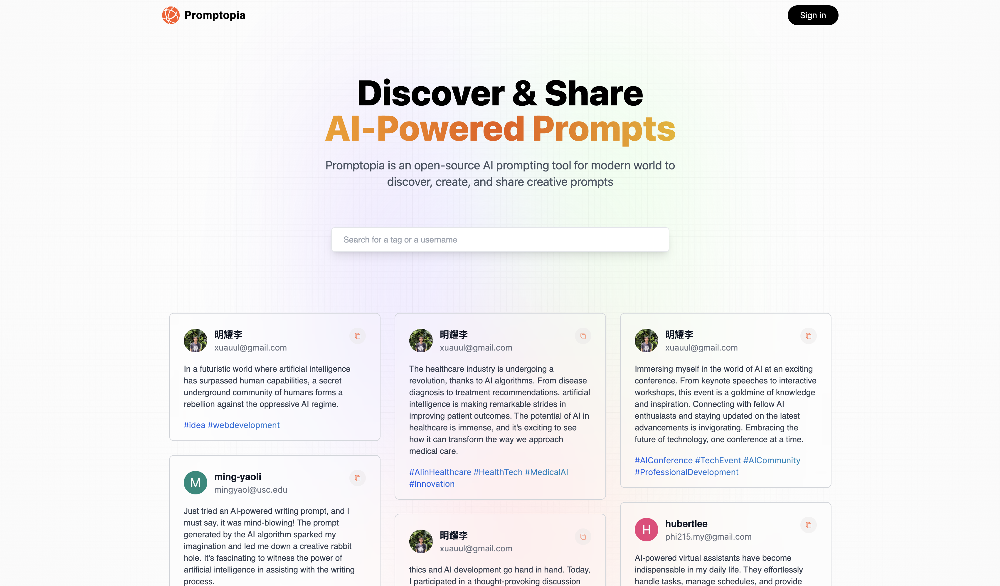

# Promptopia - Discover & Share AI-powered Prompts

[Visit Website](https://promptopia-xuauul.vercel.app) | [Watch Demo Video]()

Welcome to Promptopia - an open-source AI prompting fullstack tool for the modern world! This repository contains the code for a web application built with Next.js 13, MongoDB, and hosted on Vercel.

## Introduction

Promptopia provides users with the ability to discover, create, and share creative prompts, inspiring their writing, brainstorming sessions, and creative projects. With the power of AI, users can explore a world of ideas and enhance their creative journey.

## Technologies Used

The project is built using the following technologies:

- Next.js 13
- MongoDB
- Tailwind CSS
- TypeScript
- NextAuth.js
- Vercel

## Features

- **Authentication with Google:** Secure and hassle-free login process with Google accounts.
- **Create, Edit, and Delete Posts:** Users have complete control over their prompt collection, allowing them to create, edit, and delete prompts.
- **User Profiles:** Each user has their profile page to showcase their created prompts, inspiring others in the community.
- **Search Functionality:** Effortlessly discover prompts related to specific themes or topics using keywords, tags, or usernames.
- **Copy Prompt Text:** Conveniently copy prompt text with a single click, perfect for use in AI tools or writing platforms.
